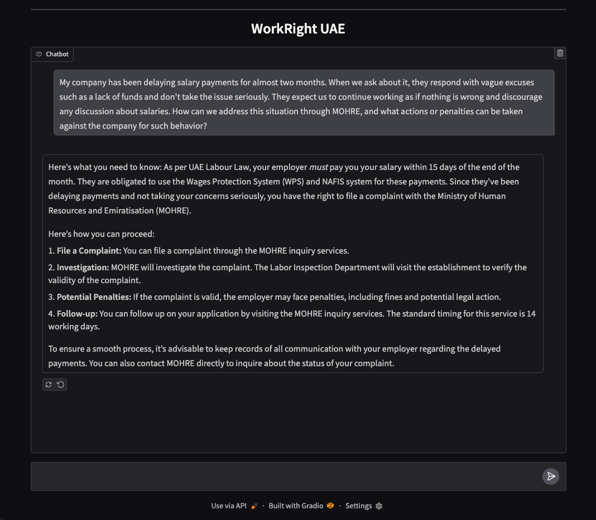

# WorkRightUAE: Fine-Tuning Small LLMs as ReAct Agents for Domain-Specific Tasks

## Overview

This project focuses on **fine-tuning small open-source language models** (e.g., Gemma3:4B) to act as **ReAct agents** for domain-specific tasks—specifically, interacting with UAE labor laws and employment regulations. The goal is to **reduce production costs** by avoiding reliance on large-scale or paid models like ChatGPT or Gemini, while still delivering robust tool-augmented reasoning.

### 🔗 [**work-right-uae model on Hugging Face**](https://huggingface.co/SamNaing/work-right-uae)

## 

## Motivation

Deploying large proprietary models in production can be prohibitively expensive and often unnecessary for specialized applications. This project explores whether a **small, instruction-tuned model** (4B or smaller) can be trained to:

- Reliably select tools in a ReAct agent setting
- Generate accurate, grounded answers
- Mimic the performance of a much larger teacher model (Mistral 7B) through knowledge distillation

---

## Dataset Construction

### Document Chunking

Using [LlamaIndex](https://www.llamaindex.ai/):

- Initial parsing with `MarkdownNodeParser`
- If a chunk exceeds 512 tokens, further split using `SentenceSplitter` with overlap

### Synthetic Question Generation

1. Embed all nodes and perform **K-Means clustering**
2. For each cluster, apply **sliding window** technique to generate questions
3. Inject **persona-based variations** (HR manager, Employer, Employee, Domestic Worker)
4. Use `Mistral-7B-AWQ` via `vLLM` to generate QA pairs

---

## ReAct Trace Generation

- Use **LlamaIndex's `Workflow` API** to generate ReAct-style agent traces
- Each trace contains:

  - User query
  - Model thought
  - Tool selection
  - Observation
  - Final answer

- Hosted Mistral 7B via `vLLM` for high-throughput generation

---

## Fine-Tuning: `Gemma3:4b-it → work-right-uae`

- Fine-tuned with [Unsloth](https://github.com/unslothai/unsloth) + `PEFT`
- **Chat template modified** to support ReAct agent flow:

  ```
  user → assistant → observation → assistant → ...
  ```

- Enabled `train_on_responses_only` to fine-tune only the `assistant` response
- Untuned `Gemma3:4b-it` struggled with:

  - Hallucinations
  - Infinite reasoning loops
  - Tool selection failures

**After fine-tuning:**

- Model understands **when to stop**
- Selects correct tool
- Avoids infinite loops and hallucinations

---

## LoRA Knowledge Distillation: `Gemma3:1b-it`

To explore model compression, knowledge distillation was attempted from 4B to 1B model.

### Problem

- KL Divergence-based loss in HuggingFace’s `GKDTrainer` requires **identical tokenizer vocab**
- `Gemma3:4b-it` and `Gemma3:1b-it` have **different tokenizers**

### Solution: ULD Loss (Universal Logit Distillation)

Implemented based on the paper:

> _“Towards Cross-Tokenizer Distillation: the Universal Logit Distillation Loss for LLMs”_

#### Key Modifications:

- Extended `SFTTrainer` instead of `GKDTrainer`
- Performed loss computation **per batch** (to reduce CUDA memory)
- Used **Top-K token filtering** to reduce unnecessary computation and accelerate training

---

## Results

| Model            | Role               | Behavior                        |
| ---------------- | ------------------ | ------------------------------- |
| `Gemma3:4b-it`   | Untuned            | Hallucinates, fails tool usage  |
| `work-right-uae` | Fine-tuned (ReAct) | Predicts tool + halts correctly |
| `Gemma3:1b-it`   | Distilled via ULD  | Still under testing             |

---

## Future Improvements

- **Merge summarizer and ReAct agent** into one compact model
- **Enhance data quality and complexity** to enable the model to handle more nuanced queries, multi-turn conversations, and complex reasoning across chat history
- **Deploy with `llama.cpp`** for CPU-only environments (reduce production cost)
- Further evaluate distilled `1B` model performance

---

## Tech Stack

- Models: `Gemma3:4b-it`, `Mistral-7B-AWQ`, `Gemma3:1b-it`
- Libraries: `LlamaIndex`, `Unsloth`, `vLLM`, `PEFT`, `Transformers`, `Ollama`, `ChromaDB`
- Distillation: Custom implementation of **Universal Logit Distillation**
